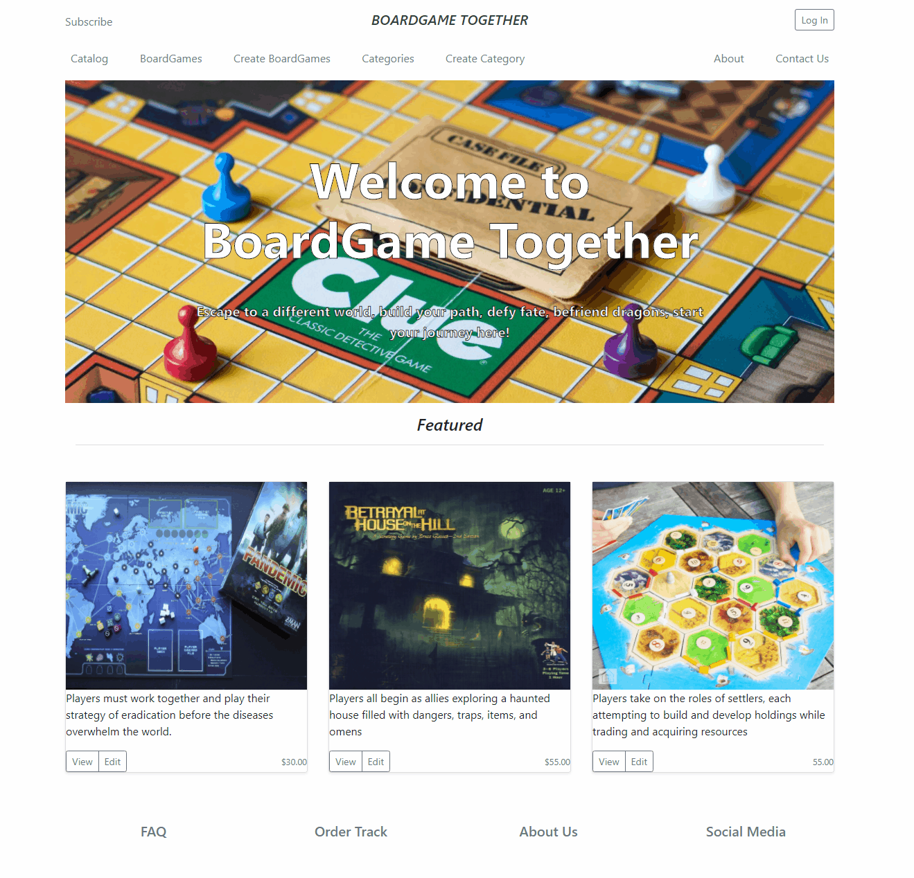

# Boardgame-Website

Basic Express application project taken from the Odin Project.
The goal was to deploy a basic inventory app that would allow CRUD operations on two basic DB tables.

I used: Node -> Express framework to build the structure, MongoDB to store database, and PUG as the templating language

